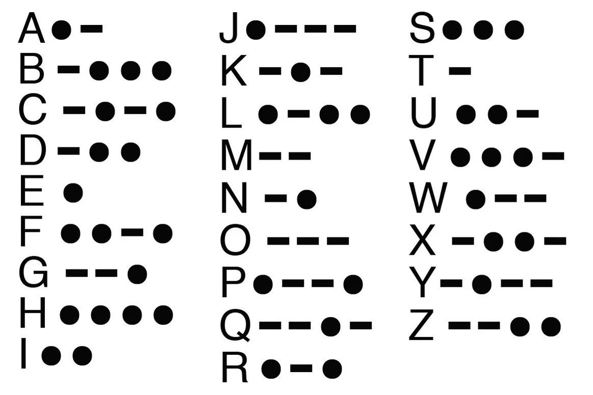

# Morse Code Decoder

> This project is a ruby program which accepts user input as morse code and then translates(decode) it to normal text.

## Built With

- Ruby

## Pre-requisites

- You need to have Ruby installed on your local machine
- Ruby bundler properly set up for installing dependencies
  > **Go here to get Ruby installer for windows** > [Windows Installer](https://rubyinstaller.org/) > **Go here to get Ruby installer for Linux** > [Linux Installer](https://www.ruby-lang.org/en/documentation/installation/) > **Go here to get Ruby installer for MacOS** > [MacOS Installer](https://www.ruby-lang.org/en/documentation/installation/)

## Setup

- Git clone `https://github.com/aceDavon/morse_decoder.git`
- cd `morse_decoder`
- run `bundle install`
- run `rubocop .` to check for linters
- run `ruby morse_code.rb` to run program

## Authors

👤 **Makoji David**

- GitHub: [@acedavon](https://github.com/acedavon)
- Twitter: [@sharkleshevon](https://twitter.com/sharkleshevon)
- LinkedIn: [Makoji David](https://linkedin.com/in/makoji-david)

👤 **Okine Kingsley**

- GitHub: [@killy10o10](https://github.com/killy10o10)
- Twitter: [@Quami_Killy](https://twitter.com/Quami_Killy)
- LinkedIn: [@Kingsley Okine](https://www.linkedin.com/in/kingsley-okine/)

## 🤝 Contributing

Contributions, issues, and feature requests are welcome!

Feel free to check the [issues page](../../issues/).

## Show your support

Give a ⭐️ if you like this project!

## Acknowledgments

- Hat tip to anyone whose code was used
- Microverse community

## 📝 License

This project is [MIT](./LICENSE) licensed.
